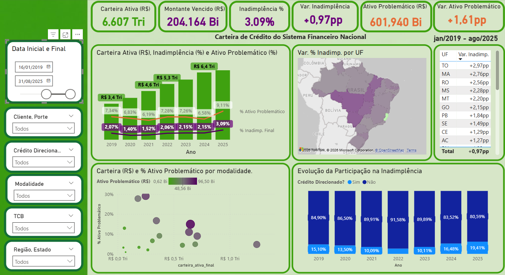
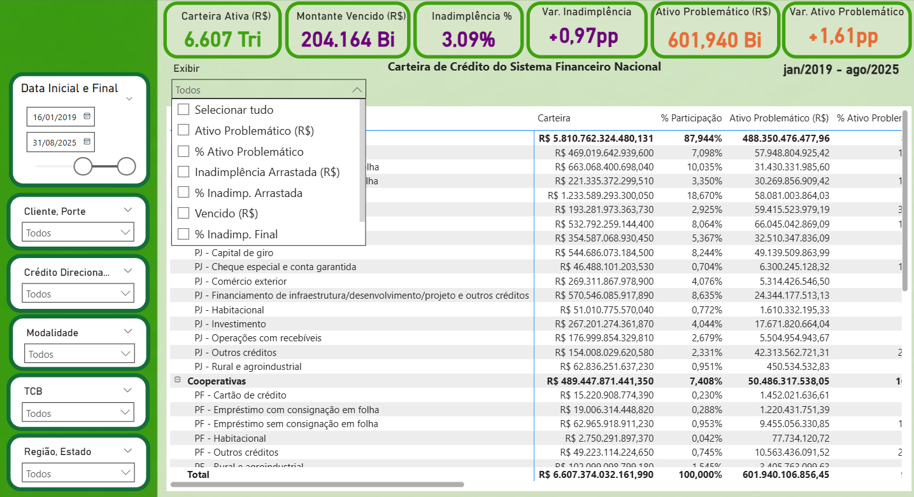

# Credit Risk & Default Analytics (Regulatory SCR Data)

## 📌 Executive Summary
This project is an end-to-end Analytics Engineering solution designed to process and analyze regulatory credit data (simulating the Brazilian Central Bank's SCR system for a financial institution). It transforms massive, complex credit portfolio data into a scalable dimensional model to track default rates, credit exposure, and risk ratings via embedded BI.

## 🎯 Business Problem
Financial institutions must constantly monitor their credit portfolio's health, tracking delinquency rates (NPL - Non-Performing Loans) across different risk bands and client segments. Processing millions of regulatory credit records on the fly crashes traditional BI tools. 

**The Solution:** I engineered a backend ETL pipeline and a dimensional data model that pre-calculates exposure and default metrics. This shifts the heavy computational load to the data warehouse, allowing the BI engine (Power BI) to render complex risk dashboards instantly.

## 🏗️ Architecture & Tech Stack
- **Data Engineering:** Python (native file streaming) and SQL COPY commands for high-performance, low-memory data extraction and bulk loading. This approach bypasses Pandas memory overhead, ensuring highly efficient processing of massive regulatory files.
- **Data Storage & Modeling:** SQL for structuring the data warehouse following the Medallion Architecture principles.
- **Data Visualization / Embedded BI:** Power BI for frontend rendering and dynamic risk calculations.
- **Cloud Data Warehouse PoC:** Google Cloud Platform (GCS & BigQuery) using Parquet, table partitioning, and clustering for analytical performance.
- **Version Control:** Git & GitHub.

## 📊 Data Architecture (Medallion Approach)
The data pipeline is structured following the Medallion architecture to ensure scalability and data quality:

1. **Bronze Layer (Raw):** Ingestion of raw regulatory credit files (SCR format) and transactional data without transformations.
2. **Silver Layer (Cleansed):** Data cleaning, deduplication, and standardization. 
3. **Gold Layer (Dimensional):** Highly optimized Star Schema (Fact and Dimension tables) designed specifically for BI consumption. This layer guarantees that the risk and default dashboards query millions of rows in milliseconds.


```markdown
## 📂 Repository Structure
```text
├── data/                   # Ignored in version control (raw and processed data)
├── src/                    
│   └── scr_bacen/          # Core Python ETL modules for BACEN data
│       ├── db.py           # Database connections and high-performance COPY inserts
│       ├── logger.py       # Execution logging and state management
│       ├── main_extractor.py # Main orchestration script (download, extract, process)
│       ├── storage.py      # Azure Blob Storage integration for caching/resilience
│       └── gcp_project/    
│           └── local_csv_to_parquet.py # Cloud DWH Proof of Concept (GCP/BigQuery)
├── sql/                    # SQL scripts for data modeling
│   ├── 01_bronze/          # Raw tables DDL
│   ├── 02_silver/          # Cleansing and standardization queries
│   └── 03_gold/            # Dimensional modeling (Star Schema)
├── requirements.txt        # Python dependencies
└── README.md               # Project documentation


## 🚀 Key Engineering Highlights
- **Decoupled Logic:** Separated extraction, transformation, and loading phases to ensure modularity and maintainability.
- **BI Optimization:** Designed the Gold layer specifically to reduce the computational load on the BI engine, proving an understanding of how VertiPaq/embedded BI engines work under the hood.
- **Scalability:** The pipeline is designed to easily accommodate new data sources or scale up using distributed computing (e.g., Databricks/Spark) if data volume increases.
- **Cloud Migration PoC (GCP):** While the main pipeline is optimized for relational databases using native SQL COPY, I included a Cloud Data Warehouse Proof of Concept (`gcp_project`). This script demonstrates parallel processing, conversion to columnar formats (Parquet), and BigQuery optimization techniques like Time Partitioning and Clustering to handle massive datasets efficiently.




